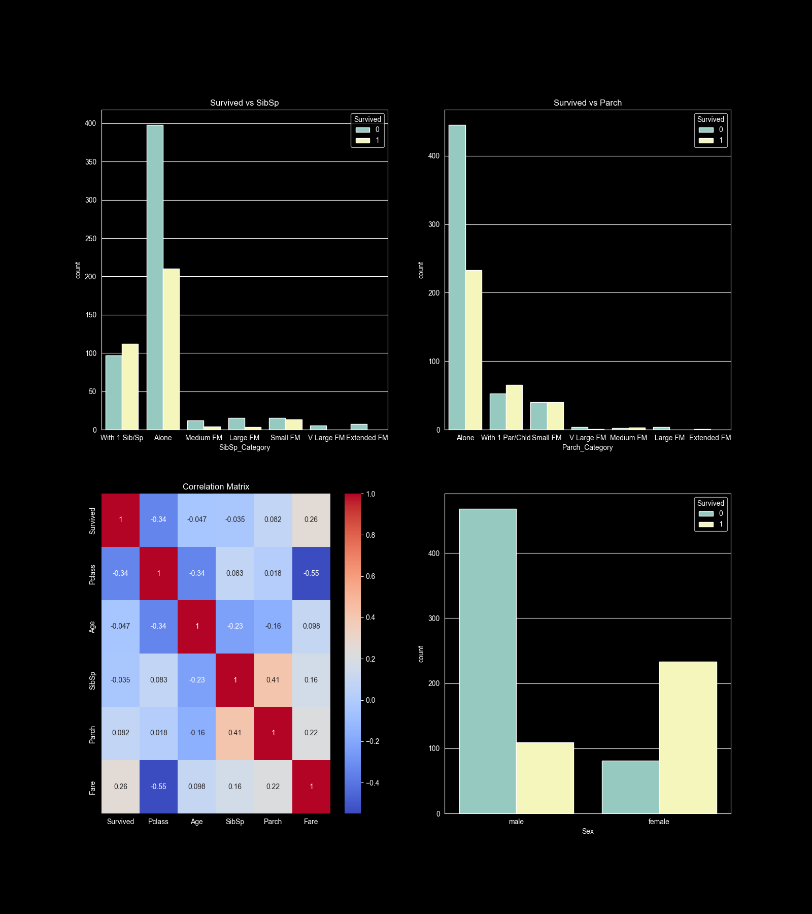

# TITANIC DATA SET ANALYSIS
## what Titanic Data Set is all about:
Titanic data set is a classical dataset used for machine learning and data analysis( EDA).It contains information
about aboard the RMS titanic,which sank in 1912 after hitting an iceberg.
The goal of analysing the data set is to explored the patterns (e.g Survival rate by gender),handling missing values and 
predicting the survival based on passenger features(i.e train a model for feature use of the same kind of data).
## FEATURES OF TITANIC DATA SET:
1. **PassengerId**: Unique Identifier for each passenger.
2. **Survived**: Passenger class(1 = 1st,2 = 2nd,etc..)
3. **Name**: Full Name
4. **Sex**: Female,Male.
5. **Age**: Age in Years
6. **SibSp**: Number of Siblings/Spouses Aboard
7. **Ticket**:Ticket number
8. **Fare**: Fare paid
9. **Cabin**: Cabin number(many misssing values)
10. **Embarked**: Port of embarkation(c = Cherboug, Q = Queenstown,S = Southampton)
### Typical Analysis
1. **Explore Patterns**(e.g Survival Rate by Gender/Pclass)
2. **Handling Missing Values**
3. **Visaulizing Relevant Categorical Data** 
4. **Dropping NONE Relevant Columns**(e.g Name,Cabin,Ticket,PassengerId).
### ***Below is a typical Visualization of Some Relevant Column with The Survival Rate.***

